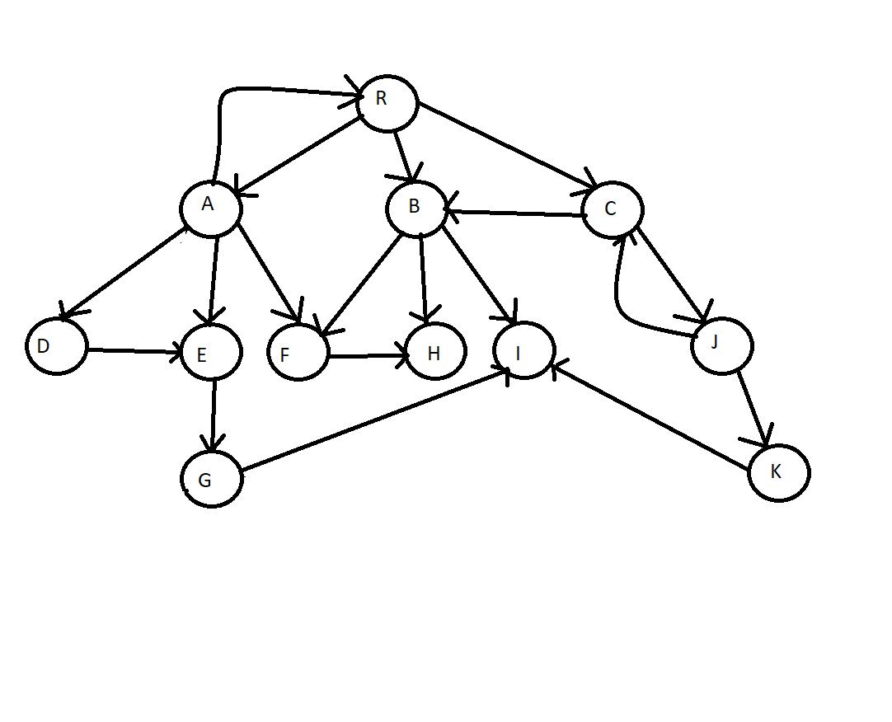

## This repository provides a simple implementation for Depth First Search and Breadth First Search for trees and graphs.
### The following image shows the tree that we run the tests on:

### The following image shows the graph that we run the tests on:

