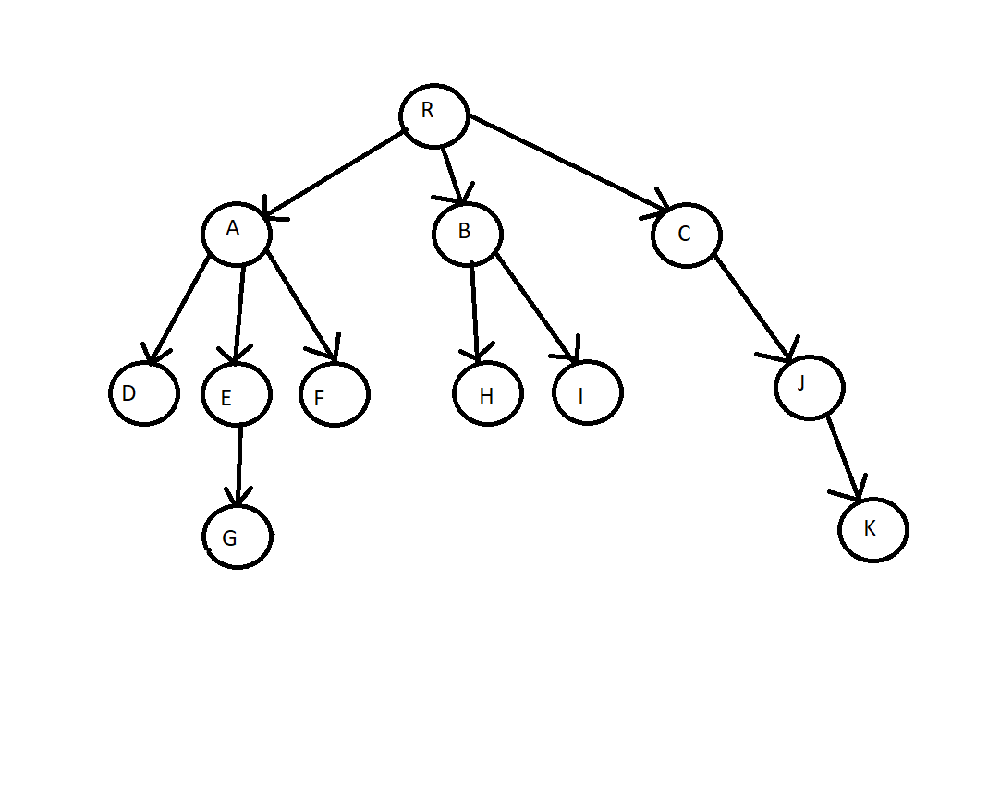

## This repository provides a simple implementation for Depth First Search (and in the future, BFS, UCS, A*) for trees and graphs.
### Tree.png and Graph.png show the tree and the graph that the algorithms traverse.

